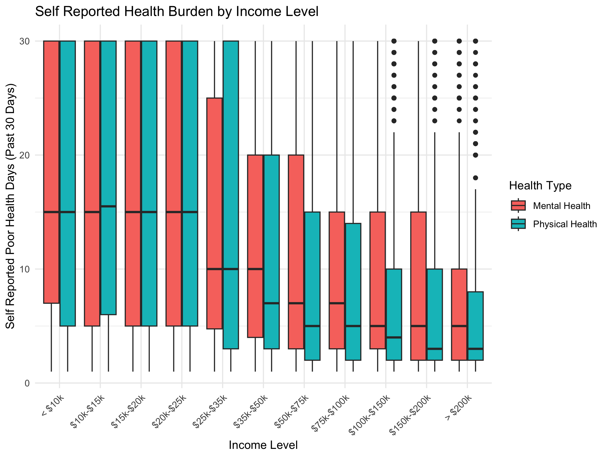

# BRFSS 2024 Health Analysis

This project examines socioeconomic patterns in self-reported mental and physical health burden using the CDC BRFSS 2024 survey.

## Key Findings

- Lower income is associated with higher reported health burden.
- Physical health burden increases with age.
- Mental health burden peaks in middle adulthood.

## Example Figure

## Data

This project uses data from the 2024 Behavioral Risk Factor Surveillance System (BRFSS), conducted by the Centers for Disease Control and Prevention (CDC).

The raw dataset is not included in this repository because of its size. It can be downloaded from the CDC BRFSS website. After downloading `LLCP2024.XPT`, place the file in the `data/` directory before rendering the Quarto document.

## Tools

- R
- tidyverse
- haven
- Quarto
- Git
- GitHub